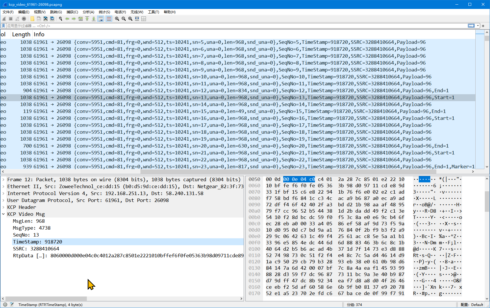

# kcp_rtp_dissector
Lua编写Wireshark Plugin解析显示KCP协议封装的RTP视频包，只支持H264

新版本（4.x）的WiresharkPortable64，直接把kcp_dissector.lua复制到 WiresharkPortable64\Data\plugins\目录就可以了。

比较老的WireShark版本参考：[https://www.cnblogs.com/Yinkaisheng/p/11119229.html](https://www.cnblogs.com/Yinkaisheng/p/11119229.html) 

